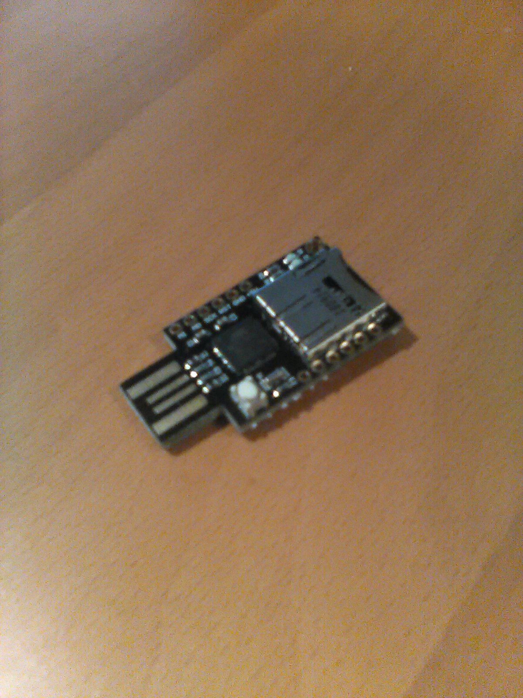

# arduino-password-manager
Simple, buttonless, password manager. Select and inject passwords or anything else without soldering. Tested on a ATMEGA32u4 (Arduino Leonardo)

I made this because I bought a board with a usb header, sd card, but no input pins. Not super practical but it was a fun first project.

The board I got was this:
